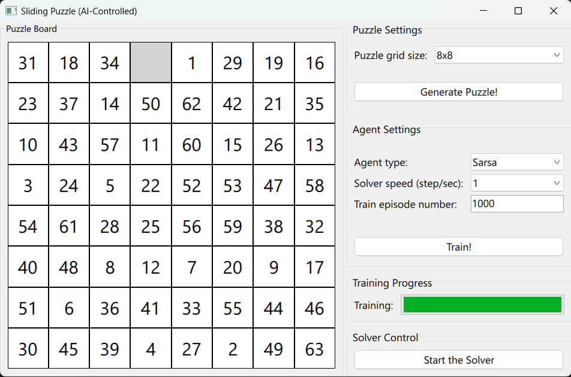

# n-puzzle
The (n²-1) sliding puzzle with Python and Reinforcement Learning.




### how to run
1. Clone the repository:
```
git clone https://github.com/AmirHossienAfshar/n-puzzle.git
```
2. Install dependencies:
```
pip install -r requirements.txt
```
3. Run the program:
```
python main.py
```
