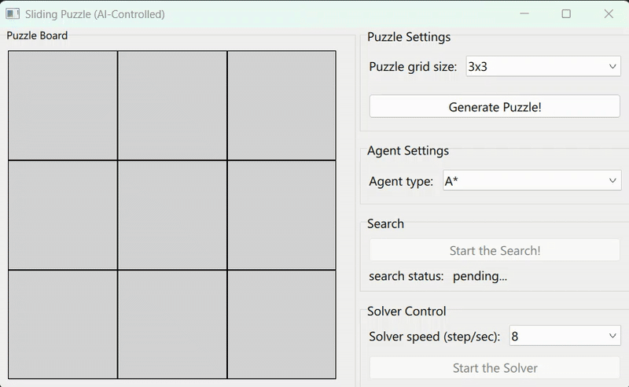
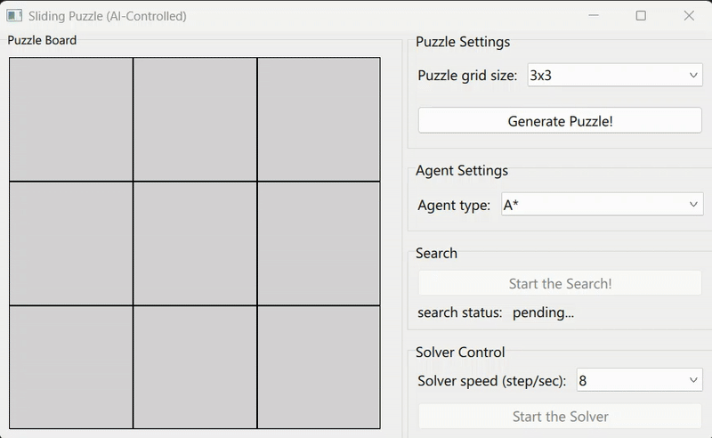
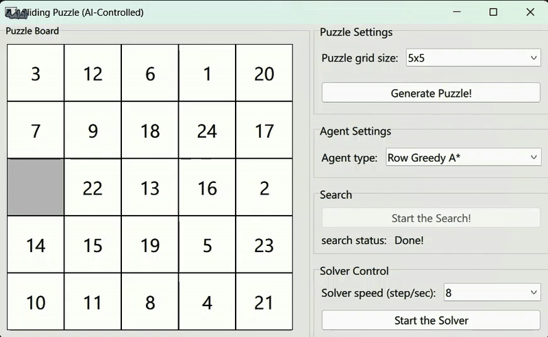

# n-puzzle

## Table of Contents

1. [Introduction](#introduction)  
2. [how to run](#how-to-run)  
3. [Puzzle Environment](#Puzzle-Environment)  
   - [Solvability Conditions](#Solvability-Conditions)  
   - [Inversions](#Inversions)
   - [Expected number of actions](#Expected-number-of-actions)
4. [Row Greedy A star solver](#Row-Greedy-A-star-solver)  
   - [features](#features)  
   - [How the Row Greedy works](#How-the-Row-Greedy-works)  
   - [Row Greedy for 5*5 puzzle](#Row-Greedy-for-5*5-puzzle)

---

## introduction

The (n²-1) sliding puzzle, implemented by PySide6/qml and solved by search and Reinforcement Learning.



---

### how to run
1. Clone the repository:
```
git clone https://github.com/AmirHossienAfshar/n-puzzle.git
```
2. Install dependencies:
```
pip install -r requirements.txt
```
3. Run the program:
```
python main.py
```

---

## Puzzle Environment
This problem inherits from the Gym environment, making it perfect for using RL agents (and non-RL ones as well).

### Solvability Conditions
The puzzle generated is guaranteed to be solvable based on the following conditions:

- **Odd N**: The puzzle instance is solvable if the number of inversions is even in the input state.
- **Even N**: when n is even, an n-by-n board is solvable if and only if the number of inversions plus the row (starting from zero) of the blank square is odd.

    - The puzzle instance is solvable if the blank is on an even row counting from the bottom (second-last, fourth-last, etc.) and the number of inversions is odd.
    - The puzzle instance is solvable if the blank is on an odd row counting from the bottom (last, third-last, fifth-last, etc.) and the number of inversions is even.
For all other cases, the puzzle instance is not solvable.




---

### Inversions
An inversion is when a pair of tiles are in the wrong order. For example, in a 3x3 puzzle, if tile 8 appears before tile 7, it counts as one inversion. The total number of inversions helps determine the solvability of the puzzle.

**good to ask**: why is this problem, simply not a sorting problem?
**answer**: because it has movement constraints! also, the goal is not the sroted array, (we allready know about that!) but is the path to that sorted array.

---

### Expected number of actions and states
Cosidering a puzzle of n*n with a single empty tile, 
$$\frac{(n-2)^2 \times 4 + (4n-8)\times 3 + 8}{n^2} = \frac{4n^2 - 4n}{n^2}$$
this will be the expected numbers of actions. by callculating the limit of that,
$$\lim_{n \to \infty} \frac{4n^2 - 4n}{n^2} = 4$$
there will be about 4 actions, for each state of the problem.

Also, for counting the expected number of states, we could simply flat the input $n \times n$ array to have a $(n^2)!$ states.

All of those said, we could conclude that this problem would be solved alot better with huristics and Rl agents, rather than the classic search methods.

---

## Row Greedy A star solver
The search class implements an A search algorithm with Manhattan distance heuristics to solve an n × n sliding puzzle efficiently. The puzzle is solved row-by-row; so instead of using an all-at-once approach to solve, it solves each row seperately. This, ensures that the memory usage is much better, specially with higher n*n environment (obviously, the search won't be the most-efficient, but much more memory saved).

### features
- A search algorithm* with Manhattan distance heuristic for optimal pathfinding.
- Solves row-by-row, enabling an efficient strategy for solving larger puzzles.
- Handles odd and even-sized puzzles differently to ensure solvability.

### How the Row Greedy works
1. **Initialization**: The agent receives the puzzle from the environment.
2. **Row Masking**: The solver masks rows cumulatively to focus on solving one row at a time.
3. **Row-by-Row Solving**: Each row is solved individually using the A* search algorithm with Manhattan distance heuristics.
4. **Reconstruction**: The solution steps are reconstructed to be compatible with the GUI, ensuring a smooth visual representation of the solving process.

This hierarchical approach reduces memory usage significantly, especially for larger puzzles, by breaking down the problem into smaller, more manageable sub-problems.

### Row Greedy for 5*5 puzzle
This method of search, can solve for the 5*5 puzzle, which all those other search methods, couldn't manage to do that. (yet the usage of memory and time is high)


